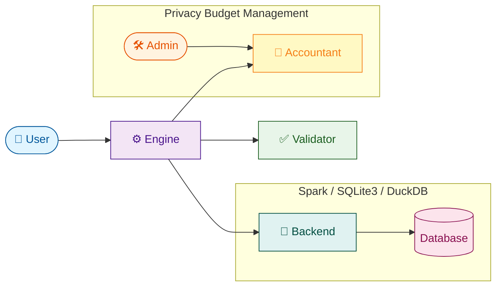

# DPSQL+
[](https://arxiv.org/abs/2602.22699)
[](https://creativecommons.org/publicdomain/zero/1.0/)

This repository contains materials developed by LY Corporation and is temporarily open-sourced for the purpose of a reference implementation of the approach described in our paper, *DPSQL+: A Differentially Private SQL Library with a Minimum Frequency Rule* (https://arxiv.org/abs/2602.22699).
 
- **Temporary Release**: This repository is temporarily available as open-source. Therefore this repository may be turn into read-only or private anytime.
- **Attribution**: All code and materials in this repository are owned by LY Corporation.

## Project Overview

DPSQL+ is a library that provides a SQL-like interface for querying sensitive data, along with privacy budget management based on differential privacy.
It is designed to provide a high level of privacy protection without requiring users to have a deep understanding of differential privacy.

⚠️ **Warning**: This code is provided for research and demonstration purposes only. It has not been reviewed or audited by any independent third party. Do not use it in production environments without conducting your own security assessment. Use at your own risk.

### Architecture

DPSQL+ consists of four main components:
- **Engine**: The core component that orchestrates the other components to process SQL queries with differential privacy.
- **Validator**: Validates SQL queries to ensure they conform to the supported syntax and semantics.
- **Accountant**: Manages the privacy budget, tracking the cumulative privacy loss across multiple queries.
- **Backend**: Interfaces with the underlying database systems (e.g., Spark, SQLite3, DuckDB) to execute queries and retrieve data.



## Installation and Usage

### Installation

Install [uv](https://docs.astral.sh/uv/) and run `uv sync` to install the required dependencies.

### Initialize Components
Import the necessary components from DPSQL+ and initialize them:

```python
from dpsql.backend import SparkSQLBackend
from dpsql.engine import Engine
from dpsql.validator import Validator
from dpsql.accountant import RenyiAccountant

sql_backend = SparkSQLBackend(spark)
validator = Validator()
accountant = RenyiAccountant(epsilon, delta)
engine = Engine(accountant, sql_backend, validator)
```

### Register Databases

Register the databases and tables you want to query with the engine, specifying the privacy unit column:

```python
engine.register_database("TITANIC", privacy_unit_columns={"passengers_features": "id", "passengers_survived": "id"})
engine.register_database("SEX", privacy_unit_columns={})
```

### Set Query Parameters

Define the parameters for the query:

```python
from dpsql.dp_params import DPParams

contribution_bound = 1
min_frequency = 10
epsilon_per_query = 0.5
delta_per_query = 5e-5
clipping = 1

dpparams = DPParams(
    contribution_bound=contribution_bound, 
    min_frequency=min_frequency, 
    epsilon=epsilon_per_query, 
    delta=delta_per_query, 
    clipping_thresholds=[None, [(0, clipping)]]
)
```

### Run a Query

Execute the query with the specified parameters:

```python
sql = """
WITH combined_data_tmp AS (
    SELECT 
        e.id,
        e.who,
        s.survived
    FROM 
        TITANIC.passengers_features AS e
    JOIN 
        TITANIC.passengers_survived AS s ON e.id = s.id
), combined_data AS (
    SELECT
        c.id,
        c.who,
        c.survived,
        w.adult_male
    FROM
        combined_data_tmp AS c
    JOIN
        SEX.is_adult_male AS w ON c.who = w.who
)
SELECT 
    adult_male, COUNT(adult_male), SUM(survived)
FROM 
    combined_data
GROUP BY 
    adult_male
"""

result = engine.execute_query(sql, dpparams)
print(result)
```

For more detailed usage examples, please refer to the notebooks in the [examples](examples/) directory.

## Citation

If you use DPSQL+ in your research or projects, please cite the following paper:

```
@misc{matsumoto2026dpsql,
    title={DPSQL+: A Differentially Private SQL Library with a Minimum Frequency Rule}, 
    author={Tomoya Matsumoto and Shokichi Takakura and Shun Takagi and Satoshi Hasegawa},
    year={2026},
    eprint={2602.22699},
    archivePrefix={arXiv},
    primaryClass={cs.CR},
    url={https://arxiv.org/abs/2602.22699}, 
}
```

## Contributions
 
As this project is temporarily open-sourced, we are not accepting contributions. For feedback or inquiries, please open an issue in this repository.

## License
 
This code is dedicated to the public domain under [CC0 1.0](https://creativecommons.org/publicdomain/zero/1.0/). 
You may copy, modify, and distribute it without restriction, and the authors make no warranties or guarantees regarding its use.
